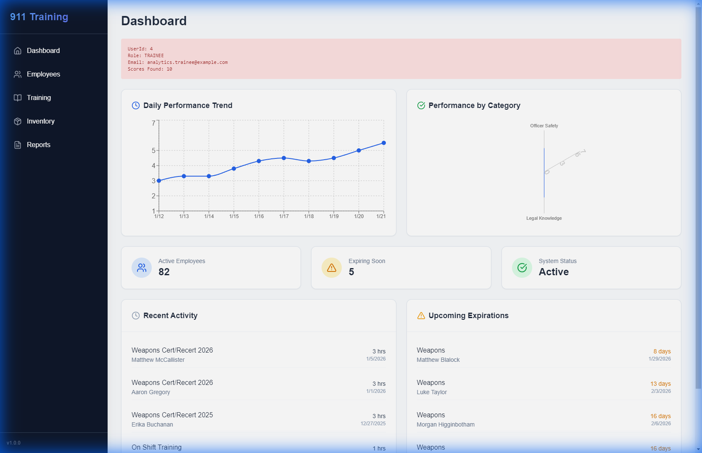
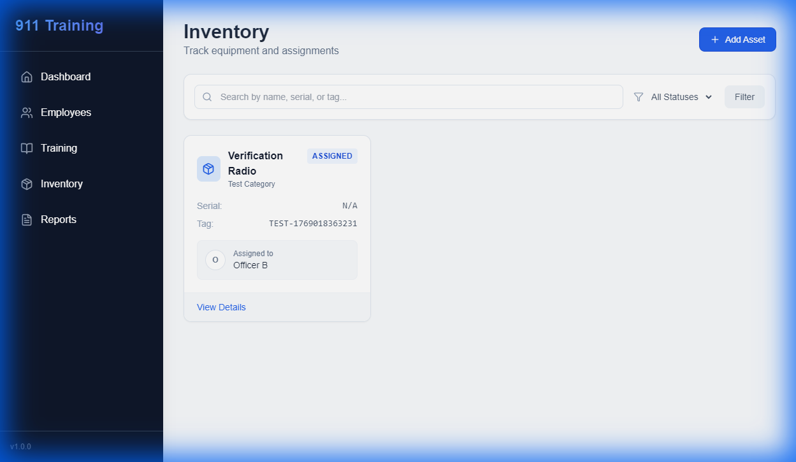
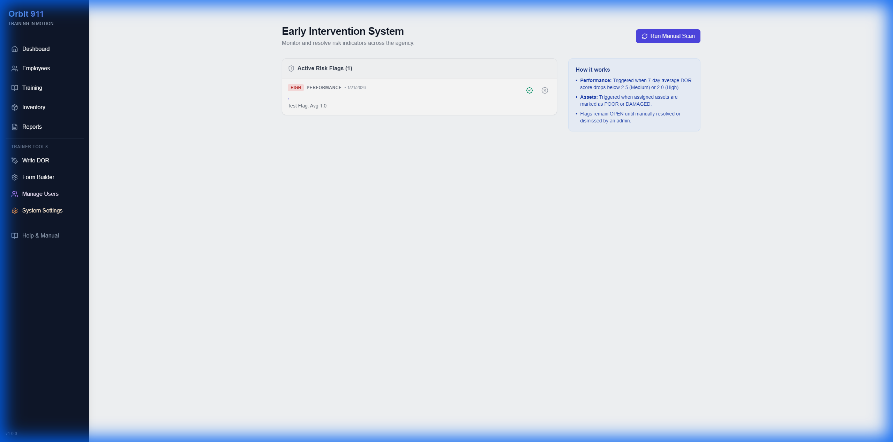
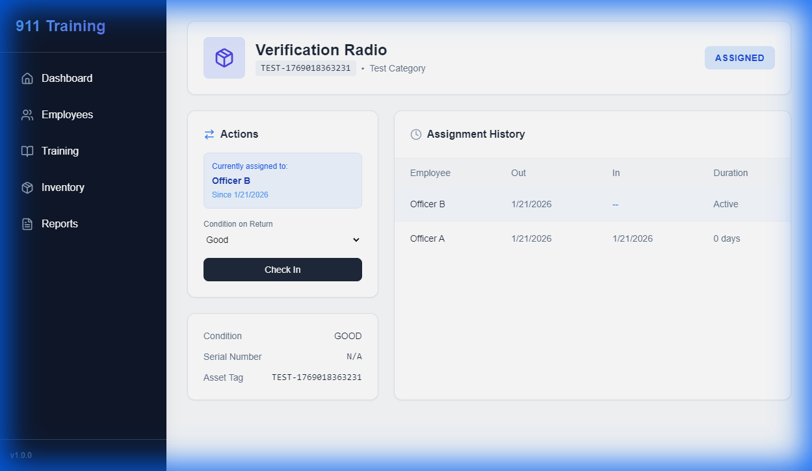

# Orbit 911 - Training Tracker

Orbit 911 is a comprehensive training and asset management system designed for 911 dispatch centers. It tracks training hours, daily observation reports (DORs), inventory, and employee performance.

## Core Features

* **Training Tracking**: Log and categorize training hours (APCO, NENA, Local).
* **Daily Observation Reports (DOR)**: Digital grading system for trainees with specialized forms.
* **Asset Management**: Track radios, headsets, and lockers assignments.
* **Early Intervention System (EIS)**: Automated flagging of performance or asset issues.
* **Audit Logging**: CJIS-compliant logging of all critical system actions.
* **Licensing**: Built-in commercial licensing enforcement.

## Gallery

| Main Dashboard | Inventory System |
| :---: | :---: |
|  |  |
| **Comprehensive Overview** | **Asset Tracking** |

| Analytics | Asset History |
| :---: | :---: |
|  |  |
| **Performance Metrics** | **Chain of Custody** |

## Documentation

* **[Deployment Guide](./DEPLOYMENT.md)**: Complete installation and setup instructions (Docker & Manual).
* **[Commercialization Roadmap](./COMMERCIALIZATION_ROADMAP.md)**: Strategy for packaging and selling the software.
* **[User Manual](./app/help/page.tsx)**: Built-in help page source (View at `/help` in app).

## Tech Stack

* **Framework**: Next.js 14 (App Router)
* **Database**: SQLite (Development/Small Deploy) or PostgreSQL (Production)
* **ORM**: Prisma
* **Authentication**: NextAuth.js v5
* **Styling**: Tailwind CSS
* **Containerization**: Docker

## Getting Started

1. **Install Dependencies**:

    ```bash
    npm install
    ```

2. **Setup Database**:

    ```bash
    npx prisma migrate dev
    npx prisma db seed
    ```

3. **Run Development Server**:

    ```bash
    npm run dev
    ```

4. **Visit**: [http://localhost:3000](http://localhost:3000)

## License

Copyright (c) 2026 Orbit 911 Solutions. All rights reserved.
Commercial license required for production use.
<!-- Vercel Trigger: Force Redeploy (Attempt 2) -->
