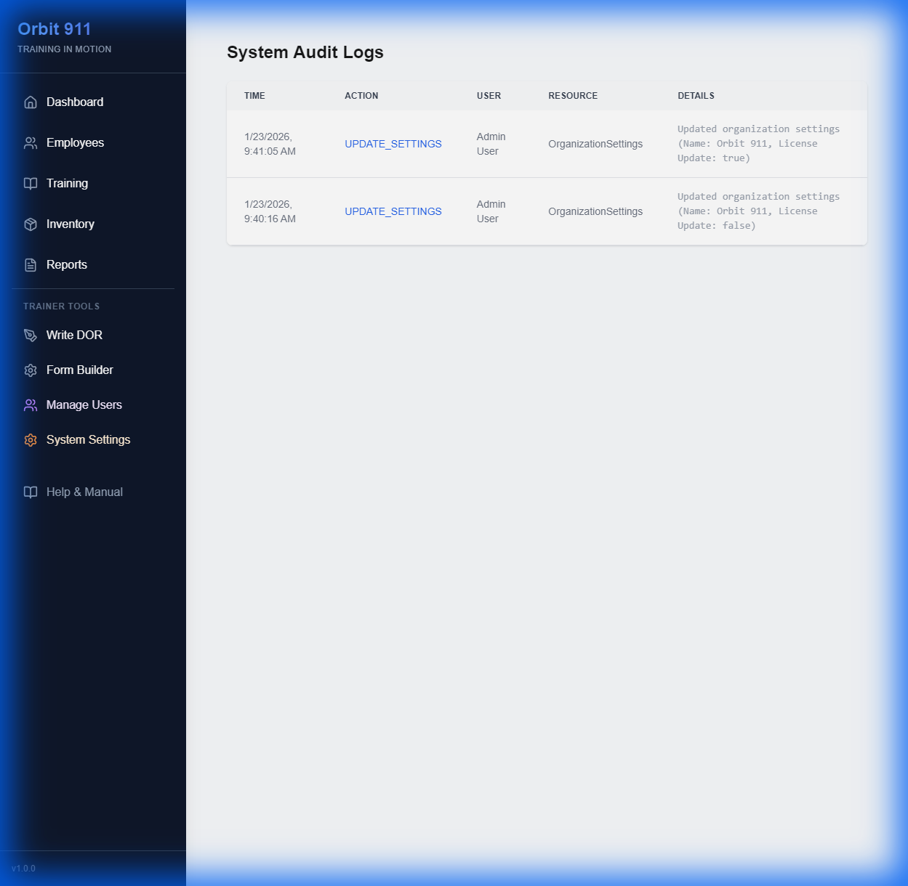
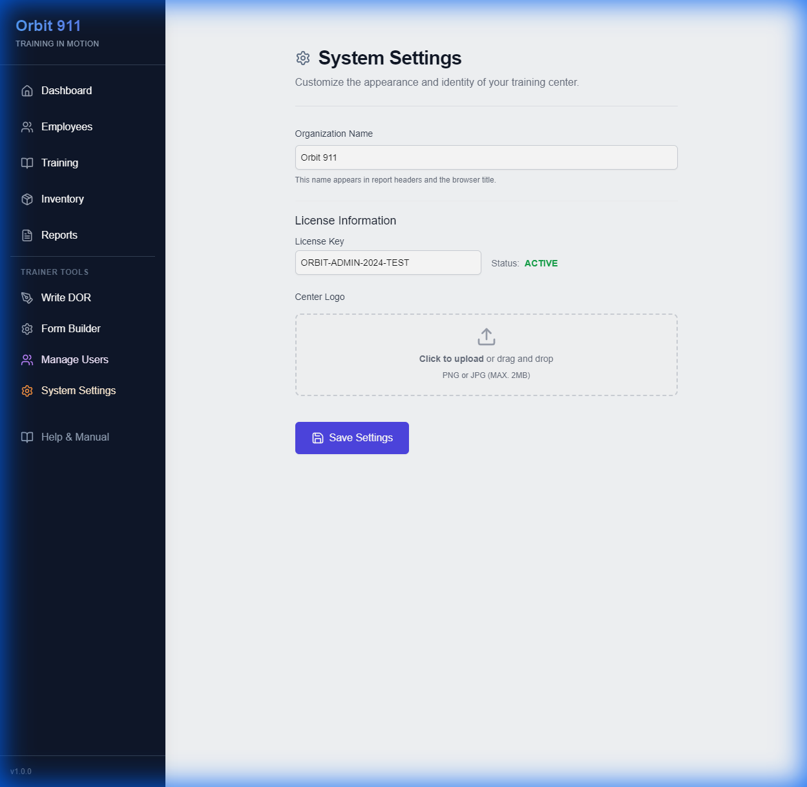

# Orbit 911 - User Manual

## 1. Dashboard Overview

The main dashboard provides a high-level view of agency performance. It differentiates between **Admin** and **Trainee** views.

*Figure 1: The main dashboard showing pending reports, analytics, and quick status.*

* **Pending DORs:** Trainees see reports waiting for their signature here.
* **Expirations:** Alerts for certifications expiring within 30 days.

### Performance Analytics

Visual insights into agency training progress and DOR scores.

*Figure 2: Radar charts and trend lines help identify areas for improvement.*

## 2. Employee Management

The Employee Detail view is the central hub for an employee's data. It aggregates training hours, inventory assignments, and DOR performance trends.

### Key Features

* **Training Log:** Complete history of attended training.
* **Certificates:** Upload and view scanned documents.
* **Assets:** See currently assigned equipment.
* **EIS Flags:** (Admin Only) Active risk alerts.

### How to Add a New Employee

1. Navigate to the **Employees** page via the sidebar.
2. Click the **"Add Employee"** button in the top right corner.
3. Enter the employee's **Full Name** (e.g., "Jane Doe").
4. Click **"Create Employee"**. They will immediately appear in the roster.

## 3. Daily Observation Reports (DOR)

Trainers use this system to grade trainees. Reports follow a standardized 1-7 scale across multiple categories (Safety, Knowledge, Performance).

### For Trainers

Create new reports from the top navigation. Standardized templates ensure consistency.

**Creating a DOR:**

1. **Select Trainee:** Choose the employee you are evaluating.
2. **Select Trainer:** Identify who is performing the evaluation (defaults to you).
3. **Rate Performance:** Score all categories (1-7 scale). Use 'N.O.' for Not Observed.
4. **Narrative:** Complete the "Most/Least Satisfactory" and "Incident" text areas.
5. **Submit:** Click to save. The trainee will be notified to sign.

### For Trainees

Log in to review submitted reports. You must digitally sign each report to acknowledge it.

## 4. Inventory & Asset Tracking

Manage high-value assets like Radios, Vehicles, and Firearms. Track who has what item and its current condition.

*Figure 3: Viewing the complete chain of custody for an asset.*

## 5. Early Intervention System (EIS)

**(Admin Only)** The EIS automatically scans data for potential risks.

* **Performance Flags:** Triggered if a trainee's average DOR score drops below 2.5 over the last 7 days.
* **Asset Flags:** Triggered if an assigned asset is marked as POOR or DAMAGED.

## 6. Security & Settings (Admin)

### Audit Logs

For CJIS compliance, critical system actions are logged in the **Audit Log** viewer (`Admin > Audit Logs`).

* Logins/Logouts
* Creating/Deleting Users
* Updating Settings
* Critical Data Changes

### How to Create a System User (Trainer/Admin)

1. Go to **Admin > Users** in the sidebar.
2. Locate the **"Create New User"** form at the top.
3. Fill in the **Name**, **Email**, and temporary **Password**.
4. Select the appropriate **Role** (e.g., 'Trainer' for FTOs).
5. Click **"Add User"**.
*Note: This creates a login account. To track their training, ensure they also have an Employee Profile.*

### Licensing

Orbit 911 requires a valid license key. Manage your license and branding in `Admin > Settings`.

> **Note:** If your license expires, the system will lock out all non-admin users until a new key is provided.
